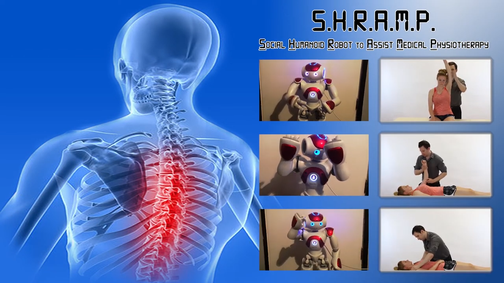

# SHRAMP: A Robot Assistant For Physiotherapy

## Our Group
  ST20123841: Arron Fenton
  
  ST20119000: Ahmed Bazina 
  
  ST20131182: Michael O'Sullivan
  
  ST20139043: William Thomas
 
## Project Aim
The project aims to research and design Upper Limb Collaborative Rehabilitation Training with NAO robot. 

## Project Abstract
The aim of the research was to investigate and find a solution to implement a social humanoid robot to aid in the delivery of physiotherapy appointment remotely during a global pandemic mainly focusing on upper limb rehabilitation training. The research has used mixed methods to come up with a solution for a social humanoid robotic assistant for upper limb rehabilitation patients. The research has identified some limitations to the Nao robots’ range of movement and the results showed that simple upper limb exercises can be implemented and executed to the end user being recovering patients. For further improvements and future work, it is essential to have a robot with the same degree of movement as a human being in addition to keeping it autonomous having the social humanoid aspect present within the medical sector.  

## Project Demo With Nao
We have added a demonstration video of S H R A M P a Social Humanoid Robot to Assist Medical Physiotherapy and how it works

Available At: https://www.youtube.com/watch?v=uBrzgLRYPTw

## Project Conclusion
The social robot has proven efficient towards the relationship and trust between the patient and test user and has proven the effectiveness on how social humanoid robotics can influence motivation and acceptance on performing physiotherapy exercises whilst also being somewhat efficient towards the informing/guiding a patient through simplistic upper-limb exercises but due to the limitations seen throughout the project our conclusion sees that having a robot that fully mimics the Degrees of Freedom of a human is important for it to be fully effective. As it stands at the moment, that means to get a fully humanoid robot would be prohibitively expensive and may be more realistic to incorporate a humanoid arm [or torso with two arms] to do the demonstrating. This, however, removes the social humanoid aspect and potentially losing the discussed improvements of trust/relationship/motivational advantages seen from naos implementation [Similarly to the end-effector exoskeletal type robots that already exist]. All, in all. Nao seems very capable as an assistant to physiotherapy but due to the limitations then we cannot see such technologies causing job insecurity to physical physiotherapists in the future as of yet.
  
  
