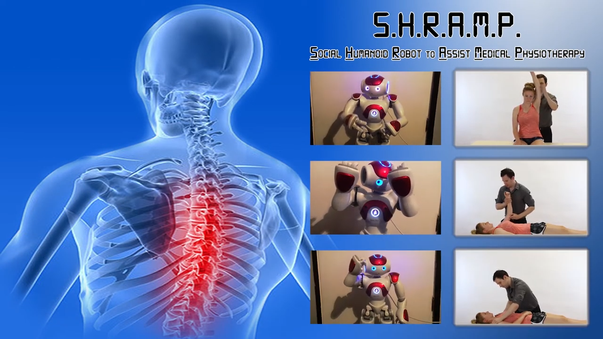

# SHRAMP: A Robot Assistant For Physiotherapy

## Our Group
  ST20123841: Arron Fenton
  
  ST20119000: Ahmed Bazina 
  
  ST20131182: Michael O'Sullivan
  
  ST20139043: William Thomas
 
## Project Aim
The project aims to research and design Upper Limb Collaborative Rehabilitation Training with NAO robot. 

## Project Abstract
To implement a social humanoid robot to aid in the delivery of physiotherapy appointment remotely during a global pandemic.  

## Project Demo With Nao
We have added a demonstration video of S H R A M P a Social Humanoid Robot to Assist Medical Physiotherapy and how it works

Available At: https://www.youtube.com/watch?v=uBrzgLRYPTw

## Project Conclusion
  
  
